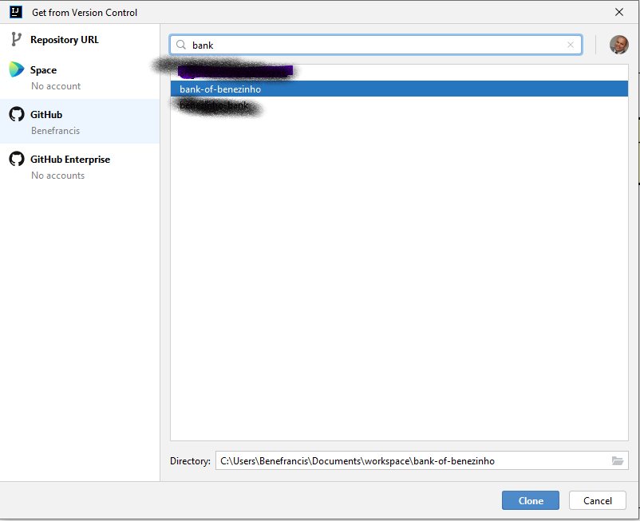
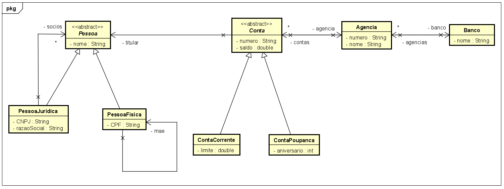

# Bank of Benezinho 🤓👍🏾

|                  | **Domain Driven Design** |
|------------------------------------------|--------------------------|
| **ALUNO:**                               | **TURMA:** 1TDSA         |
| **PROFESSOR:** Benefrancis do Nascimento | 22/05/2023               |
| **CHECK POINT III**                      | **VALE 10 PONTOS**       |
| **ENTREGAR NO TEAMS ATÉ**                | 24/05/2023 ÀS 23h59      |

# Sumário


[Estudo de caso ](#_Estudo_de_caso)

[O que deverá ser feito? ](#_O_que_devera_ser_feito)

[Diagrama de Classes ](#_Diagrama_de_Classes)

[Como Entregar ](#_Entrega)

[Correção ](#_Correcao)

<a id="_Estudo_de_caso"></a>

# Estudo de caso

A Holding Benezinho  está investindo na criação de um banco digital.
Entretanto este banco terá algumas agências com foco ao atendimento de idosos e empresários.


Contratamos você como Engenheiro de Software para ajudar a construir esse sistema.

Na sprint atual, você foi incumbido de fazer:

1. As classes de domínio do sistema conforme o DIAGRAMA DE CLASSES abaixo
2. Método capaz de instanciar todos os objetos do diagrama para que seja possível testar o programa.

<a id="_O_que_devera_ser_feito"></a>

# O que deverá ser feito?
**Você deverá:**

**Fazer o fork do projeto do github:** https://github.com/Benefrancis/bank-of-benezinho.git.

Em seguida, criar um novo projeto no Intellij IDEA com base num Sistema de Controle de Versão (você deverá estar autenticado no github). Imagem abaixo:





1. **(1 Ponto)** Criar corretamente a classe **Banco**.

    Lembre-se de encapsular os campos, criar o toString e criar dois construtores sendo:
    
    1. Com todos os atributos;
    
    2. Sem receber os atributos;
    
    3. Há uma coleção de **Agencia** na classe **Banco**. Encapsule essa coleção.

2. **(2 Pontos)** Criar corretamente a classe **Agencia**.

    Lembre-se de encapsular os campos, criar o toString e criar dois construtores sendo:
    
    1. Com todos os atributos;
   
    2. Sem receber os atributos;
   
    3. Há uma coleção de **Conta** na classe **Agencia** no atributo contas. Encapsule essa coleção.
   
    4. Há o Tipo Referência **Banco** na classe **Agencia** com o nome banco.

3. **(2,5 Pontos)** Criar corretamente a classe abstrata **Conta**.

    Lembre-se de encapsular os campos, criar o toString e criar dois construtores sendo:
    
    1. Com todos os atributos;
    
    2. Sem receber os atributos;
    
    3. Há uma coleção de **Pessoa** na classe **Conta** no atributo titulares. Encapsule essa coleção.
   
    4. Há o Tipo Referência **Agencia** na classe **Conta** com o nome agencia.
   
    5. A classe **Conta** possui duas classes herdeiras:

      1. ContaCorrente;
      2. ContaPoupanca.

4. **(1 Ponto)** Criar corretamente a classe abstrata **Pessoa**.

    Lembre-se de encapsular os campos, criar o toString e criar dois construtores sendo:
    
    1. Com todos os atributos;
    
    2. Sem receber os atributos;
    
    3. A classe Seguro possui três classes herdeiras:
    
        1. Pessoa Física;
        2. Pessoa Jurídica.

5. **(1 Ponto)** Criar corretamente a classe **PessoaFisica**.

   Lembre-se de encapsular os campos, criar o toString e criar dois construtores sendo:
   
   1. Com todos os atributos;
   
   2. Sem receber os atributos;
   
   3. Há um atributo de referência **PessoaFisica** na classe **PessoaFisica** com o nome mae.

6. **(1 Ponto)** Criar corretamente a classe **PessoaJuridica**.

   Lembre-se de encapsular os campos, criar o toString e criar dois construtores sendo:
   
   1. Com todos os atributos;
   
   2. Sem receber os atributos;
   
   3. Há uma coleção de **Pessoa** na classe **PessoaJuridica** com o nome socios. Encapsule essa coleção.


7. **(2,5 Pontos)** Criar um método capaz de, com base nas informações fornecidas pelo usuário do programa (utilize o JoptionPAne para capturar todos os dados). O programa deverá instanciar todos os objetos e ao final imprimir todas as informações de pelo menos uma Conta Bancária. 

<a id="_Diagrama_de_Classes"></a>

# Diagrama de Classes



<a id="_Entrega"></a>

# Como Entregar

**A entrega deverá ser feita pelo Teams**, porém não se esqueça de fazer o **commit** e **push** do projeto no github.


<a id="_Correcao"></a>

# Correção

A correção será disponibilizada no github do professor (branch correcao):

Para acessar digite no prompt:

```shell
git clone https://github.com/Benefrancis/bank-of-benezinho.git && cd bank-of-benezinho && git checkout correcao
```

A atividade é individual, em caso de fraude de qualquer tipo todos os envolvidos receberão nota **ZERO**.


Boa avaliação.
